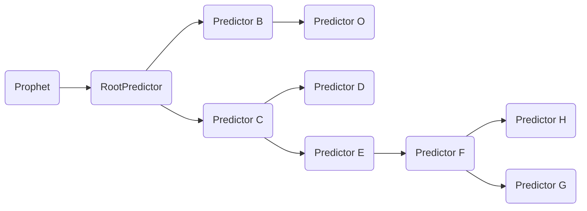

# Concepts

## Prophet
“**先知**”能根据事先定义好的 Mold 以及对应的 prophet_config 预测出一个 question 的答案（由用户上传到 Mold 所对应的 project  下的一个文件生成的）。
“**先知**”的这种能力是通过生成 predictor **树形结构**来实现的，**树形结构**是由多个按二级 schema 分组的 predictor 子树 （如下图 Predictor B、C）组成。

## SchemaPredictor
Predictor 是根据 prophet_config 中对应的 schema 的配置生成的树形结构中的一个节点，对需要产生预测答案的节点，会生成相应的 models 列表。
在预测时，models 列表会输出对应 schema 的预测答案，predictor 节点把预测的答案进行相应的转换、组装以及分组后（如需要），最终把答案添加到预测结果中。

## Model
Model 工作的原理是通过统计，在**标注答案**的基础上归纳总结出通用的答案特征，在预测时基于**粗略定位**以及对应的答案特征，预测出相应的答案。

# Glossary
1. EnumPredictor

    `枚举值`预测的基类，对于具体的 Mold，可通过实现其 `predict` 方法来完成枚举值的预测。

1. DatasetItem

    某个 question 的**标注答案**对应的 pdfinsight 数据，包括 elements、syllabuses 信息。训练时需要。

# FAQ
